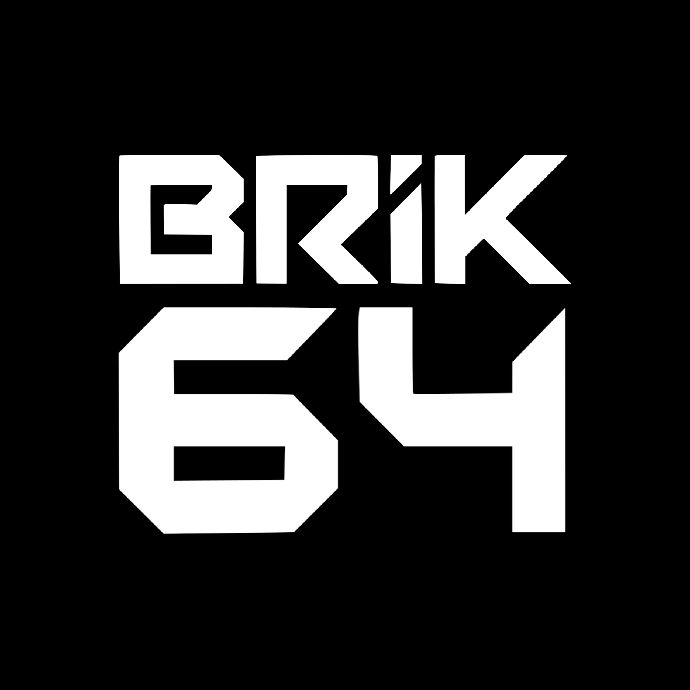

<div align="center">

<picture>
  <source media="(prefers-color-scheme: dark)" srcset="assets/logo-white.png">
  <source media="(prefers-color-scheme: light)" srcset="assets/logo-dark.png">
  
</picture>

# BRIK-64

### Digital Circuitality — Software That Works Like Hardware

[](https://github.com/brik64/brik64-dist-releases/releases)
[](LICENSE)
[](#thermodynamic-coherence-engine)
[](#formal-foundations)
[](#self-hosting-and-the-fixpoint)

[](https://www.npmjs.com/package/@brik64/core)
[](https://crates.io/crates/brik64-core)
[](https://pypi.org/project/brik64/)

**[brik64.dev](https://brik64.dev) · [docs.brik64.dev](https://docs.brik64.dev) · [Examples](https://github.com/brik64/brik64-community-examples) · [Releases](https://github.com/brik64/brik64-dist-releases)**

</div>

---

## What Is Digital Circuitality?

**Digital Circuitality** is the formal property of a computational system that operates as a closed circuit — where every input domain is bounded, every operation is verified, every output range is proven, and no external noise source can introduce undefined behavior.

A system with **Φ_c = 1** (circuit closure = 1) satisfies Digital Circuitality. A system with **Φ_c = 0** does not. There is no partial credit and no gray area. Either the computation is closed, or it is not.

Digital Circuitality is both a mathematical property and an engineering discipline — the practice of designing software the way hardware engineers design circuits: with defined boundaries, formal specifications, and compositional correctness guarantees.

The analogy with electrical engineering is precise, not metaphorical:

| Hardware | Software (BRIK-64) |
|----------|-------------------|
| Logic gate | Monomer (MC_00–MC_63) |
| Circuit | Polymer (composition of monomers) |
| PCB schematic | PCD (Printed Circuit Description) |
| Signal integrity | Thermodynamic Coherence (Φ_c) |
| Gate specification | Coq proof |
| Chip certification | TCE certification |
| Hardware description language (VHDL/Verilog) | PCD language |

The key insight: hardware engineers solved the correctness problem decades ago. A NAND gate certified to specification always behaves correctly — not probabilistically, not "most of the time," but provably and always. BRIK-64 brings this discipline to software.

---

## The Problem with Modern Software

### An Unbounded Space of Possible Failure

Consider a simple task: validate a user's email address and store it in a database. In a modern software stack, this might involve:

- A frontend in React, Angular, or Vue (each with different validation semantics)
- An API layer in Express, FastAPI, Flask, or Spring Boot
- An ORM in Hibernate, SQLAlchemy, or Prisma
- A validation library with its own regex dialect
- A database driver with its own type coercion rules
- Environment-specific encoding assumptions (UTF-8 vs. system locale)
- Error handling patterns that differ across frameworks

Each of these choices introduces failure modes that the other components cannot anticipate. A string that is valid in JavaScript may fail the Python validator. A value that the ORM considers a valid email may be rejected by the database. A success response from one layer may silently corrupt the state of another.

This is not a matter of programmer carelessness. It is the structural consequence of building software from an **unbounded, uncoordinated collection of components** with no formal compatibility guarantees. Modern software is not a system — it is a coalition.

### The Thermodynamic Model

Physics encountered this problem in the 19th century and solved it.

Classical thermodynamics works by distinguishing between **closed systems** and **open systems**. A closed system has defined boundaries: energy enters and leaves through known channels, and the total energy is conserved within those boundaries. An open system interacts with an unbounded environment: heat flows in from unknown sources, entropy increases in ways that cannot be fully tracked, and the laws of thermodynamics no longer apply in their simple form.

The laws of thermodynamics — conservation of energy, entropy increase, thermal equilibrium — are powerful precisely because they are stated for closed systems. Open the boundary, and prediction becomes impossible.

Modern software is thermodynamically open. Data flows in from network sockets, file systems, user input, random number generators, hardware clocks, and third-party services. The "computation" is entangled with its environment at every level. There is no boundary, no formal closure, no way to say "within this region, I can guarantee correctness."

BRIK-64 applies closed-system thinking to computation: every program explicitly declares its boundary, every external input is typed and bounded at the boundary, and every internal computation is verified to stay within the declared domain.

### Mathematical Singularities in Code

In mathematics, a **singularity** is a point where a function diverges — where the value becomes undefined, infinite, or discontinuous. Division by zero is the canonical example: `f(x) = 1/x` is undefined at `x = 0`, and approaches infinity as `x → 0`. Near the singularity, behavior becomes unpredictable. At the singularity, the mathematical machinery breaks down entirely.

Software has identical problems, but the language of "singularity" is rarely used:

**Integer overflow** is a singularity. The function `f(n) = n + 1` is defined for mathematical integers but has a singularity at `n = 2^63 - 1` in 64-bit signed arithmetic. When this singularity is reached, the value wraps around to `-2^63` — a large negative number — and every subsequent computation is semantically wrong. The program continues executing, but its mathematical model has broken down.

**Null pointer dereference** is a singularity. A pointer that represents a memory address has a singularity at address `0`. Dereferencing the null pointer causes undefined behavior — in practice, a crash — but the interesting failure is often that the null value propagated through multiple layers before reaching the point of dereference. The singularity was created far from where it manifested.

**Floating-point accumulation** is a slow-moving singularity. Each floating-point addition introduces a rounding error bounded by machine epsilon. After thousands of operations, the accumulated error may be significant. Financial calculations that process millions of transactions may develop errors that grow without bound — a gradual divergence, but a divergence nonetheless.

**The common structure**: a value enters a region of the computation where the programmer's intended mathematical model diverges from the physical model of the machine. The computation continues — the machine never "knows" that something is wrong — but the results are semantically undefined from that point forward.

BRIK-64 addresses this at the language level: every monomer has a formally specified input domain, and the compiler refuses to construct compositions where a value might leave its domain. Singularities are impossible by construction.

### Why Tests Cannot Solve This

The software industry's primary response to the correctness problem is testing. Write unit tests. Measure code coverage. Add integration tests. Deploy canaries. Monitor production metrics.

Testing is valuable and necessary. But testing cannot prove the absence of bugs — it can only demonstrate their presence. The fundamental limitation is mathematical:

The input space of any real program is infinite. You cannot test all inputs. You can only test a sample. Whether that sample is representative of the failure modes that will occur in production is, itself, unknowable without a formal model of the program's behavior.

More concretely: a test suite with 100% line coverage may still miss integer overflow at boundary values (if no test exercises the maximum value), race conditions that only manifest under specific timing (if the test environment does not reproduce production timing), and interactions between components that were tested in isolation (if the integration test environment does not reproduce the production configuration).

Formal verification can prove the absence of bugs, but only within a formal specification. Writing formal specifications is hard. The specifications themselves can be incorrect. And formal verification scales poorly: verifying even simple programs requires significant expertise, and the complexity grows faster than linearly with program size.

BRIK-64's approach: **make the formal specification inseparable from the program**. The specification and the implementation are the same artifact. There is no gap between "what we said we would do" and "what the code does."

---

## BRIK-64 Architecture

### The 64 Monomers

BRIK-64 provides exactly 64 atomic operations — *monomers* — organized in 8 families of 8. Every BRIK-64 program is a composition of these 64 operations. The space is finite, enumerated, and completely specified.

Each monomer has:
- A **Coq proof** establishing its formal specification
- A **type signature** specifying input and output types
- A **domain proof** establishing the valid input range
- A **range proof** establishing the guaranteed output range
- A **termination proof** establishing that the operation always completes

| Family | Monomers | Domain |
|--------|----------|--------|
| Arithmetic | MC_00–MC_07 | Bounded integer arithmetic (`ADD8`, `MUL8`, `CLAMP`, ...) |
| Logic | MC_08–MC_15 | Bitwise and boolean operations (`AND8`, `XOR8`, `NOT8`, ...) |
| Memory | MC_16–MC_23 | Stack and heap operations (`LOAD`, `STORE`, `PUSH`, ...) |
| Control | MC_24–MC_31 | Flow control (`IF`, `LOOP`, `CALL`, `NOP`, ...) |
| I/O | MC_32–MC_39 | File and stream I/O (`READ`, `WRITE`, `OPEN`, ...) |
| String | MC_40–MC_47 | Text processing (`CONCAT`, `SUBSTR`, `LEN`, ...) |
| Crypto | MC_48–MC_55 | Cryptographic operations (`HASH`, `SIGN`, `VERIFY`, ...) |
| System | MC_56–MC_63 | OS interface (`TIME`, `ENV`, `PID`, ...) |

### EVA Algebra

Programs in BRIK-64 are algebraic expressions over the monomer space, using three composition operators:

```
A ⊗ B   Sequential composition: apply A, then apply B to the result
A ∥ B   Parallel composition: apply A and B to independent inputs simultaneously
A ⊕ B   Conditional composition: apply A if condition holds, else apply B
```

These operators satisfy proven algebraic laws:
- **Associativity**: `(A ⊗ B) ⊗ C = A ⊗ (B ⊗ C)`
- **Commutativity of parallel**: `A ∥ B = B ∥ A`
- **Identity**: `Id ⊗ A = A ⊗ Id = A`
- **Closure**: if `Φ_c(A) = 1` and `Φ_c(B) = 1`, then `Φ_c(A ⊗ B) = 1`

The **closure law** is the central property of EVA algebra. Once a component is certified as a closed circuit, composing it with any other closed-circuit component produces another closed circuit. Correctness is **preserved by composition** — you never have to re-verify the whole program from scratch.

### Thermodynamic Coherence Engine

Every BRIK-64 program is evaluated by the TCE, which measures:

| Metric | Symbol | Threshold |
|--------|--------|-----------|
| Coherence Energy | E_c | < 1.0 |
| Design Entropy | H_d | < 0.25 |
| Dynamic Entropy | S_d | < 0.15 |
| Structural Coherence | C_s | > 0.90 |
| Entropy-Temperature Coefficient | ETC | < 0.95 |
| Noise Budget | ΔN | < 0.10 |
| **Circuit Closure** | **Φ_c** | **= 1** |

`Φ_c = 1` is the binary certification result: the circuit is closed. A program with `Φ_c = 0` does not compile.

The TCE connects computation to physics through the **Landauer Limit** (Paper II): every irreversible bit operation dissipates a minimum of `k_B · T · ln(2) ≈ 2.87 × 10⁻²¹ J` at room temperature. The **ΔN metric** (Noise Budget) measures how much information your program destroys versus preserves — it is the measurable distance between your program and the thermodynamic boundary. A certified program with `ΔN = 0` operates at that boundary: the **Landauer Gap** is zero.

This has a direct consequence: a BRIK-64 Certified program is subject to exactly one failure mode — the hardware running it fails first. Modern silicon operates at error rates of approximately 10⁻¹⁹ per operation. Logic errors, type errors, integer overflow, and undefined behavior are not rare events in a certified program. They are structurally impossible.

### PCD — Printed Circuit Description

Programs are written in PCD, a language that expresses monomer compositions as circuit schematics:

```pcd
PC adder_bounded {
    // 8-bit addition with saturation — no overflow possible
    let sum = MC_00.ADD8(a, b);
    let result = MC_07.CLAMP(sum, 0, 255);
    OUTPUT result;
}
```

```pcd
PC message_hash {
    import "stdlib/crypto.pcd";

    fn process(msg) {
        let length = MC_43.LEN(msg);
        if (length == 0) { return ""; }
        if (length > 4096) { return ""; }     // domain boundary enforced
        let trimmed = MC_44.TRIM(msg);
        return MC_48.HASH(trimmed);
    }

    let input = MC_63.ENV("ARGV_1");          // reads argv[1]
    let result = process(input);
    let n = MC_43.LEN(result);
    MC_58.WRITE(1, result, n);
    OUTPUT 0;
}
```

Every string operation is length-bounded. Every hash input is validated. The circuit is closed: `Φ_c = 1`.

---

## Working with BRIK-64 Today

Digital Circuitality is available now — no new hardware required.

### Write PCD and compile to any target

PCD is a full Turing-complete language. Write your logic as a circuit schematic and compile to your deployment target:

```bash
brikc compile src/main.pcd              # Native x86-64 ELF — standalone, no libc
brikc compile src/main.pcd --target rs  # Emit idiomatic Rust source
brikc compile src/main.pcd --target js  # Emit JavaScript (ES2022)
brikc compile src/main.pcd --target py  # Emit Python 3.10+
brikc compile src/main.pcd --target wasm32  # Emit WebAssembly
```

The output is standard code in the target language — no foreign runtime, no binary blobs, no BRIK-64 dependency at runtime. A certified PCD program compiles to certified Rust, certified JavaScript, certified Python: the guarantees travel with the generated code.

| Target | Flag | Output |
|--------|------|--------|
| Native x86-64 | (default) | Standalone ELF — no libc, no runtime |
| Rust | `--target rs` | Idiomatic `.rs` source |
| JavaScript | `--target js` | ES2022 module |
| Python | `--target py` | Python 3.10+ module |
| WebAssembly | `--target wasm32` | `.wasm` binary |
| BIR bytecode | `--target bir` | Portable BRIK-64 IR |

### Use BRIK-64 libraries in your existing code

The 64 Core monomers are published as native libraries. No new language required to start using Digital Circuitality.

#### Rust

```toml
[dependencies]
brik64-core = "2.0.0"
```
```rust
use brik64_core::{mc, eva};

let result = mc::arithmetic::add8(200, 100);   // saturating → 255
let (q, r) = mc::arithmetic::div8(17, 5);      // (3, 2) — no panic on div/0

// EVA algebra: compose operations into verified pipelines
let pipeline = eva::seq(
    |x| mc::arithmetic::add8(x, 10),
    |x| mc::arithmetic::mul8(x, 2),
);
```
> [crates.io/crates/brik64-core](https://crates.io/crates/brik64-core) | [crates.io/crates/brik64-bir](https://crates.io/crates/brik64-bir) (embeddable BIR runtime)

#### TypeScript / JavaScript

```bash
npm install @brik64/core
```
```typescript
import { mc, eva } from '@brik64/core';

const result = mc.arithmetic.add8(200, 100);   // 255
const [q, r] = mc.arithmetic.div8(17, 5);      // [3, 2]

const hash = await mc.crypto.hashSha256(new TextEncoder().encode('hello'));
```
> [npmjs.com/package/@brik64/core](https://www.npmjs.com/package/@brik64/core) | Full TypeScript | Works in Node.js & browsers

#### Python

```bash
pip install brik64
```
```python
from brik64 import mc, eva

result = mc.arithmetic.add8(200, 100)          # 255
q, r   = mc.arithmetic.div8(17, 5)            # (3, 2)

pipeline = eva.pipeline(
    lambda x: mc.arithmetic.add8(x, 10),
    lambda x: mc.arithmetic.mul8(x, 2),
)
```
> [pypi.org/project/brik64/](https://pypi.org/project/brik64/) | Python 3.10+ | No dependencies

Any function built exclusively from Core monomers (MC_00–MC_63) via EVA operators retains its `Φ_c = 1` guarantee — regardless of which language it runs in.

---

## Self-Hosting and the Fixpoint

The `brikc` compiler — written in PCD — compiles itself. This produces a **fixpoint**: the binary generated by compiling `brikc.pcd` with itself is bit-for-bit identical to the binary that did the compiling.

```
Gen0  =  Rust_bootstrap_compiler(brikc.pcd)
Gen1  =  Gen0(brikc.pcd)
Gen2  =  Gen1(brikc.pcd)
Gen3  =  Gen2(brikc.pcd)
Gen4  =  Gen3(brikc.pcd)

Gen1 == Gen2 == Gen3 == Gen4
Fixpoint hash: 7229cfcde9613de42eda4dd207da3bac80d2bf2b5f778f3270c2321e8e489e95
```

This is the solution to Ken Thompson's "trusting trust" problem. Any modification to the compiler source changes the fixpoint hash. The hash is the cryptographic identity of the compiler — reproducible by anyone, verifiable against the published value.

The distributed `brikc` binary is itself a PCD-compiled ELF:

```
brikc_cli_dispatch.pcd  ──[brikc]──►  brikc ELF  (708 KB, no Rust runtime)

Dispatch ELF fixpoint:
gen1 == gen2 == 9cbad73a5f5699abc5654ace9a396f7af042be56b80de3de49d5ce03cd23dcfa
PCD_BUILD_TOOLCHAIN_PASS
```

---

## AI-Native Design

BRIK-64 is designed from the ground up for AI-generated code.

The problem with AI code generation is not that models generate syntactically incorrect code — they rarely do. The problem is that **correctness in general-purpose languages is undecidable from syntax alone**. An AI can write Python that looks correct, passes static analysis, and even passes tests — but is semantically wrong in ways that only manifest under specific runtime conditions.

BRIK-64 addresses this structurally:

**Finite operation space**: 64 operations with known, bounded, formally verified behavior. An AI generating BRIK-64 code cannot accidentally use an operation with undefined behavior — none exist.

**Automatic certification**: The TCE certifies or rejects every program. The AI does not write tests; the compiler verifies correctness as part of compilation.

**No undefined behavior**: Every operation either succeeds within its specified domain or is rejected at compile time. There is no "implementation-defined" behavior, no "unspecified" behavior, no undefined behavior.

**Deterministic execution**: Same input always produces same output. AI-generated BRIK-64 code can be validated with a small number of examples, and the results generalize.

> *"An AI doesn't need a better language. It needs a language where incorrect programs cannot compile."*

---

## BPU — Hardware-Enforced Safety

The BPU (BRIK Processing Unit) is the hardware implementation of Digital Circuitality: a coprocessor that makes Φ_c enforcement a physical property, not a software check.

**Architecture**:
- **64 Monomer Units**: one dedicated silicon circuit per monomer
- **EVA Router**: hardware implementation of ⊗, ∥, ⊕ composition
- **TCE Unit**: real-time hardware certification — produces Φ_c ∈ {0, 1} before execution

**Key property**: the BPU cannot be instructed to execute a program with `Φ_c = 0`. This is not a software policy. It is a hardware gate. A BPU-equipped system is physically incapable of running uncertified code.

The implication for AI safety: current alignment approaches train AI systems to *want* to behave correctly. The BPU approach enforces what the AI is *physically able* to do. A system whose actions route through a BPU can only take actions that are formally certified.

The regulatory analogy: seatbelts were voluntary, then recommended, then mandatory. ABS followed the same path. As AI systems become more capable, hardware-enforced behavioral bounds will follow the same trajectory.

---

## Formal Foundations

207 Coq proof files. Zero `Admitted` statements.

**EVA Algebra**:
- Associativity, commutativity, and identity for all three composition operators
- Closure preservation: certified compositions of certified components remain certified
- Distributivity laws for parallel/sequential interaction

**Monomer Correctness** (per monomer):
- Input domain specification and enforcement
- Output range proof
- Postcondition proof for all valid inputs
- Termination proof

**TCE Soundness**:
- Completeness: every `Φ_c = 1` program is accepted
- Soundness: no `Φ_c = 0` program is accepted
- Compositionality: `TCE(A ⊗ B)` follows from `TCE(A)` and `TCE(B)`

---

## What We Have & What's Coming

### Current: v2.0.0

| Component | Status |
|-----------|--------|
| PCD compiler (`brikc`) self-hosting, 64 monomers | ✅ |
| EVA algebra: ⊗ ∥ ⊕ with proven algebraic laws | ✅ |
| TCE certification engine | ✅ |
| Self-compilation fixpoint (Gen1==Gen2==Gen3==Gen4) | ✅ |
| Module system, stdlib, closures, structs, pattern matching | ✅ |
| WASM backend, LSP, fmt, REPL | ✅ |
| PCD CLI dispatch: standalone ELF, no Rust runtime | ✅ |
| 207 Coq proofs, 0 Admitted | ✅ |

### Expansion: v2.5.0 and Beyond

**BRIK-64 Open: Extended Monomers (MC_64–MC_127)**

64 additional monomers that connect certified Core logic to the real world. They operate under declared contracts, not formal Coq proofs. A program using only Core monomers is **BRIK-64 Certified** (Ω = 1). A program mixing Core + Extended is **BRIK-64 Open** — certified where it is Core, contracted at the external boundary.

| Family | Range | Domain |
|--------|-------|--------|
| Float64 | MC_64–71 | IEEE 754 floating point — `FADD`, `FMUL`, `FSQRT`, `FCONV` |
| Math | MC_72–79 | Transcendentals — `SIN`, `COS`, `LOG`, `EXP`, `POW` |
| Network | MC_80–87 | TCP, UDP, DNS, HTTP, TLS |
| Graphics | MC_88–95 | Framebuffer, pixel, line, blit, text |
| Audio | MC_96–103 | Play, mix, stream, seek |
| Filesystem+ | MC_104–111 | Directory ops, watch, temp, chmod |
| Concurrency | MC_112–119 | Spawn, join, channels, mutex, atomic |
| Interop/FFI | MC_120–127 | FFI, WASM exec, Python eval, JSON |

```bash
brikc compile src/main.pcd          # Core only — rejects MC_64+
brikc compile --open src/main.pcd   # Core + Extended allowed
```

**Certification Registry** — A public, append-only registry at `brik64.dev/registry`:
- Programs submit and receive a cryptographically signed certificate
- Certificate anchored in an Ethereum L2 Merkle log every hour
- Any certificate is verifiable against the on-chain root without trusting `brik64.dev`
- Badge types: **CERTIFIED** (Ω = 1, green), **OPEN XX%** (partial, blue)

**Live Badge System**:
```markdown
[](https://brik64.dev/cert/sha256:7229cf)
```

The badge makes a real-time request on every page load. If the hash is not in the registry, the badge shows **UNVERIFIED** — automatically, without human intervention. A static PNG badge can be forged. A live badge cannot.

What this enables: a BRIK-64 Certified program can claim something no existing certification standard can —

| Standard | Claim | Mechanism |
|----------|-------|-----------|
| ISO 26262 (automotive) | "We followed the process" | Audit trail |
| DO-178C (avionics) | "We ran the tests" | Test logs |
| Common Criteria EAL7 | "Design was reviewed" | Expert evaluation |
| **BRIK-64 Certified** | **"Incorrect programs cannot compile"** | **Structural impossibility** |

**BPU Silicon** — Reference implementation of the BPU coprocessor:
- RTL specification in synthesizable Verilog
- FPGA prototype (Xilinx/Intel)
- ASIC tape-out and ARM-style licensing model
- Only Core monomers (MC_00–MC_63) run in silicon; Extended run in software

**Multi-target Compilation**:
- Native ARM64 (Apple Silicon, ARM servers)
- RISC-V (open hardware targets)
- BPU bytecode (direct hardware execution)

---

## Roadmap

| Phase | Version | Status | Deliverable |
|-------|---------|--------|-------------|
| Self-Hosting Fixpoint | v2.0.0 | ✅ Complete | `brikc` compiles itself; Gen1==Gen2==Gen3==Gen4 |
| Extended Monomers | v2.1.0–v2.4.0 | 🚧 In Development | MC_64–MC_127: Float64, Math, Network, Graphics, Audio, Filesystem+, Concurrency, FFI |
| Certification Registry | v3.0.0 | 🗓 Planned | Public append-only registry at `brik64.dev/registry`; circuit packages (Ω=1) anchored to Arbitrum L2 |
| Circuit Marketplace | v3.0.0 | 🗓 Planned | Pro users publish certified PCD circuits importable like npm/cargo/PyPI packages |
| Multi-Platform | v4.0.0 | 🗓 Planned | ARM64 (Apple Silicon), RISC-V, BPU bytecode |
| BPU Silicon | Research | 🔬 Research | RTL specification, FPGA prototype, ASIC tape-out — software policy circuits become silicon enforcement |

### Certification Registry & Circuit Marketplace

Once the registry is live, certified programs (Ω=1) become importable circuit packages:

```bash
# Publish a circuit (Pro tier)
brikc publish src/hash_pipeline.pcd --name brik64/hash-pipeline --version 1.0.0

# Import in PCD
import { hash_pipeline } from "brik64/hash-pipeline@1.0.0";
```

Every registered circuit receives a cryptographically signed certificate anchored in an Ethereum L2 Merkle log every hour. Any certificate is verifiable against the on-chain root without trusting `brik64.dev`.

```json
{
  "hash":    "sha256:7229cfcde9613de42eda4dd207da3bac80d2bf2b...",
  "omega":   1,
  "phi_c":   1.0,
  "chain":   "arbitrum-one",
  "block":   234891203,
  "anchor":  "0x4a2b...f901"
}
```

### BPU Silicon — Software Becomes Hardware

The BPU (BRIK Processing Unit) is the hardware implementation of Digital Circuitality: a coprocessor that makes Φ_c enforcement a **physical property**, not a software check.

```
Software policy circuits (today)  →  FPGA prototype  →  ASIC tape-out  →  Mandatory standard
```

A BPU-equipped system is **physically incapable** of running uncertified code. This is not a software policy. It is a hardware gate. The regulatory trajectory mirrors ABS and seatbelts: voluntary → recommended → mandatory.

> Full details in [docs.brik64.dev/roadmap](https://docs.brik64.dev/roadmap)

---

## Testing & Debugging

### Do I need to write tests?

**For Core programs (MC_00–MC_63 only):** if it compiles, it is correct. The CMF verifier — not a test runner — proves correctness before the program runs. You do not write unit tests to verify that `add(2, 3) == 5`. The compiler already proved it.

**For BRIK-64 Open programs (Core + Extended monomers):** the Core sections remain proven. The Extended sections (network, float, FFI, audio...) operate under declared contracts and require conventional testing at those boundaries.

> The rule: you test that you built **the right thing**. BRIK-64 proves that you built **the thing right**.

### How safe is generated code?

When you compile PCD to Rust, JavaScript, Python, or WASM, the generated code **inherits the Φ_c = 1 proof**. The proof happened at compile time. The target language is the execution vehicle — not the proof substrate.

```bash
brikc compile src/main.pcd --target rs   # certified Rust
brikc compile src/main.pcd --target js   # certified JavaScript
brikc compile src/main.pcd --target py   # certified Python
```

You do not need a test framework in the target language to trust the output. It is provably correct before a test runner ever executes.

To generate a test scaffold that documents the certified properties as executable assertions:

```bash
brikc compile src/main.pcd --target rs --emit-tests
# Generates: main.rs + main_spec.rs
```

The generated tests will always pass — they encode the proof as runnable assertions. Useful for CI pipelines that require test files and for documentation purposes.

### What about Extended monomers?

Extended monomers (MC_64–MC_127) connect certified logic to the real world: floating point, networking, graphics, FFI. They operate under **declared contracts**, not formal proofs.

| Monomer | Why it can fail |
|---------|----------------|
| TCP_CONN | Server unreachable |
| HTTP_GET | Timeout, 5xx, malformed body |
| FADD | NaN propagation (0.0/0.0) |
| FFI_CALL | Segfault in native library |
| SPAWN | Resource exhaustion |

The **Core sections** of an Open program remain Φ_c = 1 — proven. Extended monomers are at the boundary. Extended monomers will ship with a standard test suite covering contract tests, error-path tests, and boundary tests. A **mock provider** for testing is included:

```pcd
import "stdlib/mock.pcd";

PC test_network {
    let result = HTTP_GET.mock("https://api.example.com", 200, "{\"ok\": true}");
    OUTPUT result.body;
}
```

### Debugging

BRIK-64 programs fail at **compile time**, not at runtime. The CMF error message is your debugger:

```bash
brikc check circuit.pcd
# [CMF] Circuit closedness (Φ_c): 0.917 ← FAIL
# Error: Branch 'error_path' in 'process_input' has no OUTPUT.
# → line 47: if (x < 0) { return -1; }
```

The error is precise: which function, which branch, why Φ_c < 1. No "NullPointerException at runtime after 3 hours" — the failure is at the logical design level.

| Tool | What it does |
|------|-------------|
| `brikc check` | CMF verification without compiling |
| `brikc check --json` | Machine-readable output for CI |
| `brikc repl` | Interactive monomer exploration |
| `brikc check --self` | Verify compiler binary integrity |

A step-through debugger (breakpoints, variable inspection) is on the roadmap for v3.x.

→ Full reference: [docs.brik64.dev/pcd/testing](https://docs.brik64.dev/pcd/testing)

---

## Getting Started

```bash
# Install (Linux x86-64)
curl -L https://brik64.dev/install | sh

# Or download directly
curl -L https://github.com/brik64/brik64-dist-releases/releases/download/v2.0.0/brikc-v2.0.0-linux-x86_64 -o brikc
chmod +x brikc

# Verify installation
./brikc version
./brikc verify
./brikc catalog    # list all 64 monomers
```

---

## Repository Structure

| Repository | Description |
|------------|-------------|
| [brik64/brik64](https://github.com/brik64/brik64) | Project overview — this repository |
| [brik64/brik64-dist-releases](https://github.com/brik64/brik64-dist-releases) | Compiler binaries and release artifacts |
| [brik64/brik64-community-examples](https://github.com/brik64/brik64-community-examples) | Example PCD programs and tutorials |
| [brik64/brik64-tools-skills](https://github.com/brik64/brik64-tools-skills) | Claude Code skills for BRIK-64 development |
| [brik64/brik64-community-awesome](https://github.com/brik64/brik64-community-awesome) | Curated resources, tools, and projects |

---

## License

BRIK-64 public components are licensed under the [Apache License 2.0](LICENSE).

Apache 2.0 includes an explicit patent grant (Section 3) — users of the open-source components receive a perpetual, royalty-free patent license. The grant cannot be revoked unless you initiate patent litigation against BRIK-64 Inc.

*Digital Circuitality™, BRIK-64™, PCD™, and BPU™ are trademarks of BRIK-64 Inc.*

For licensing inquiries, enterprise support, or partnerships: [info@brik64.com](mailto:info@brik64.com)

---

## Resources

- **Website**: [brik64.dev](https://brik64.dev)
- **Documentation**: [docs.brik64.dev](https://docs.brik64.dev)
- **Digital Circuitality**: [digitalcircuitality.com](https://digitalcircuitality.com)
- **Releases**: [github.com/brik64/brik64-dist-releases](https://github.com/brik64/brik64-dist-releases)
- **Examples**: [github.com/brik64/brik64-community-examples](https://github.com/brik64/brik64-community-examples)
- **GitHub**: [github.com/brik64](https://github.com/brik64)

---

<div align="center">

**© 2026 BRIK-64 Inc. All rights reserved.**

*Digital Circuitality™ · BRIK-64™ · PCD™ · BPU™ are trademarks of BRIK-64 Inc.*

[](https://github.com/brik64)
[](https://brik64.dev)
[](https://docs.brik64.dev)

</div>

